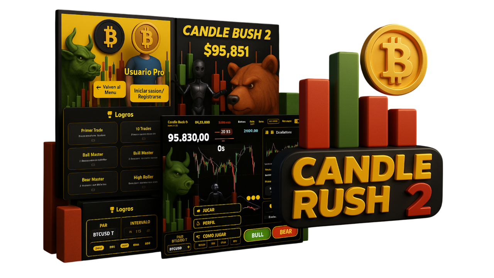

<p align="center">
  
</p>

# CandleRush2: Crypto Betting Game

> Simulador de apuestas algorítmicas sobre velas y tendencias del mercado cripto. 
> ¡Apuesta manual o automáticamente y explora la lógica detrás de cada decisión!

---

## 🗂️ Índice Rápido

- [🚀 Resumen y Propósito](#resumen-y-propósito)
- [🛠️ Cómo empezar](#cómo-empezar)
- [🎲 Cómo Funciona el Juego](#cómo-funciona-el-juego)
- [🤖 AutoMix: Algoritmo Multi-Voto](#automix-algoritmo-multi-voto)
- [📊 Sistema de Votos y Decisión](#sistema-de-votos-y-decisión)
- [🎯 Detección de Rachas](#detección-de-rachas)
- [🧩 Componentes Principales](#componentes-principales)
- [🔌 Integración Binance API](#integración-binance-api)
- [🧠 Memorias y Transparencia](#memorias-y-transparencia)
- [🕯️ Candle Predictor (Simulador de Velas)](#candle-predictor-simulador-de-velas)
- [⚙️ Personalización y FAQ](#personalización-y-faq)
- [👥 Créditos y Licencia](#créditos-y-licencia)

---

# 🚀 Resumen y Propósito

CandleRush2 es una plataforma gamificada de predicción de mercados, donde los usuarios apuestan sobre el comportamiento de velas japonesas (candlesticks) en criptomonedas. El objetivo es ofrecer una experiencia educativa, transparente y científicamente fundamentada, combinando análisis técnico, probabilidad y gamificación.

---

# 🛠️ Cómo empezar

**Requisitos mínimos:**
- Node.js >= 18
- npm >= 9
- Navegador moderno

**Instalación:**
```bash
npm install
```

**Ejecución en local:**
```bash
npm run dev
```

**Estructura de carpetas:**
- `app/`: Rutas y layout principal
- `components/`: Componentes de UI y lógica del juego
  - `game/`: Lógica y UI específica del juego
  - `ui/`: Componentes reutilizables
- `context/`: Contextos globales (juego, usuario, logros)

---

# 🎲 Cómo Funciona el Juego

El juego simula apuestas sobre el movimiento del precio de criptomonedas usando análisis técnico. Los usuarios pueden:
- Hacer apuestas manuales
- Usar el sistema AutoMix para apuestas automáticas
- Ver resultados en tiempo real
- Analizar patrones y señales técnicas

---

# 🤖 AutoMix: Algoritmo Multi-Voto

AutoMix es el cerebro del sistema que toma decisiones de trading basadas en múltiples señales técnicas. Utiliza una combinación de indicadores clásicos y patrones de mercado.

### Indicadores Principales

AutoMix integra los siguientes indicadores:
- **Mayoría de velas:** Análisis de las últimas 70 velas
- **RSI (Relative Strength Index):** Señal alcista cuando supera 50, bajista cuando baja de 40
- **MACD (Moving Average Convergence Divergence):** Señal alcista cuando la línea MACD está por encima de la línea de señal
- **Fibonacci:** Detecta rebotes en niveles clave (0.236, 0.382, 0.5, 0.618, 0.786)
- **Valle:** Identifica patrones de apertura y cierre de valles alcistas y bajistas
- **Tendencia general:** Análisis de las últimas 70 velas
- **Tendencia de volumen:** Análisis del volumen en las últimas 30 velas
- **Golden Cross/Death Cross:** Señales basadas en cruces de medias móviles
- **Posición EMA 55/200:** Posición del precio respecto a medias móviles a largo plazo
- **Whale Trades:** Análisis de operaciones de grandes inversores
- **ADX + Memoria:** Indicador de fuerza de tendencia con memoria histórica

---

# 📊 Sistema de Votos y Decisión

### Sistema de Votación Proporcional

Cada señal contribuye con un peso específico:
- **Indicadores principales:** 1 voto (Mayoría, RSI, MACD, Fibonacci, Valle, Tendencia)
- **Indicadores secundarios:** 0.5 votos (EMA 55/200)
- **Whale Trades:** 2 votos (debido a su importancia)

Total posible: 12.5 votos por lado (BULLISH/BEARISH)

### Proceso de Decisión

1. Cada señal aporta su voto según su dirección
2. Se suman todos los votos BULLISH y BEARISH
3. Si hay empate, el MACD decide
4. Si no hay mayoría ni RSI claro, la dirección se elige aleatoriamente

---

# 🎯 Detección de Rachas

AutoMix incluye un sistema avanzado de detección de rachas ganadoras/perdedoras:

### Detección de Pérdidas

- Revisa las últimas 15 trades
- Cambia dirección después de 4 pérdidas consecutivas en la misma dirección
- Resetea contadores cuando cambia de dirección

### Detección de Ganancias

- Mantiene la dirección actual después de 2 ganancias consecutivas
- Ignora inversiones basadas en patrones cuando hay una racha ganadora
- Ayuda a mantener tendencias ganadoras

### Beneficios del Sistema de Rachas

- Reacción más rápida a pérdidas
- Mantenimiento de tendencias ganadoras
- Mejor gestión del riesgo
- Equilibrio entre agresividad y conservadurismo

---

# 🧩 Componentes Principales

### Componentes Principales

- `game-screen.tsx`: Pantalla principal y lógica de interacción
- `candlestick-chart.tsx`: Gráfico de velas y señales técnicas
- `bet-result-modal.tsx`: Resultados de apuestas y análisis
- `autoMixMemory.ts`: Almacenamiento de señales y resultados
- `macd-decision.ts`: Lógica central de decisión multi-voto

### Sistema de Memoria

- Todas las decisiones se almacenan en localStorage
- Registro histórico completo de trades
- Posibilidad de auditar y analizar patrones
- Transparencia en el proceso de decisión

---

# 🔌 Integración Binance API

El sistema puede conectarse a la API de Binance para:
- Obtener datos de mercado en tiempo real
- Simular apuestas sobre datos reales
- Mantener sincronización con el mercado
- Validar señales técnicas con datos actuales

---

# 🧠 Memorias y Transparencia

### Sistema de Memoria

- Almacena todas las señales y decisiones
- Permite análisis posterior de patrones
- Facilita auditoría del sistema
- Mantiene histórico de trades y resultados

### Transparencia

- Todas las decisiones son registradas
- Posibilidad de revisar el proceso de decisión
- Análisis de patrones de éxito y error
- Verificación de señales técnicas

---

# ⚙️ Personalización y FAQ

### Personalización

- Modificación de umbrales de indicadores
- Añadido de nuevas señales
- Personalización de lógica de votación
- Ajuste de parámetros de rachas

### FAQ

- ¿Cómo funciona AutoMix?
- ¿Cómo se toman las decisiones?
- ¿Qué indicadores se usan?
- ¿Cómo se gestiona el riesgo?
- ¿Cómo se analizan las rachas?

---


# 🕯️ Candle Predictor (Simulador de Velas)

## Descripción General

El Candle Predictor es el motor de simulación algorítmica de velas japonesas de CandleRush2. Permite generar, en tiempo real y de forma realista, secuencias de velas simuladas que emulan el comportamiento de mercados cripto, integrando lógica de tendencias, rangos, rupturas (breakouts), eventos de whale trades y volatilidad dinámica.

### Objetivo
- Ofrecer un entorno de predicción y backtesting donde los usuarios pueden apostar sobre velas futuras, incluso en ausencia de datos reales.
- Proveer una experiencia inmersiva y educativa, mostrando cómo se forman tendencias, rangos, rupturas y eventos de volatilidad en mercados reales.

## Arquitectura y Construcción

- **Ubicación principal:** `utils/autoDraw.ts` (núcleo de simulación)
- **Integración:** Se conecta con el gráfico principal (`candlestick-chart.tsx`), el contexto de juego y la API de whale trades.
- **Tipos:** Extiende el tipo `Candle` para soportar propiedades como `breakoutType`, `volatileRandom`, `isSimulated`, etc.
- **Activación:** El modo Auto Draw se activa automáticamente al entrar en fase de predicción, y se desactiva y limpia al llegar una nueva vela real.

## Algoritmos y Lógica

### 1. Fases de Mercado
- Alterna entre fases de tendencia y rango, con duración aleatoria y límites máximos para evitar estancamiento.
- La tendencia puede invertirse por probabilidad, eventos extremos o influencia de whale trades.

### 2. Breakouts y Volatilidad
- Detecta rupturas de precio respecto al punto inicial de simulación, clasificando la ruptura como `weak`, `medium` o `strong` según la distancia recorrida.
- Aplica un boost de volatilidad y fuerza la tendencia en la dirección de la ruptura.
- Introduce velas volátiles aleatorias (~1% de probabilidad), con sesgo direccional según la tendencia actual.

### 3. Whale Trades
- Integra señales de whale trades en tiempo real, forzando la dirección de la tendencia cuando hay desequilibrio significativo de grandes operaciones.
- Utiliza la función `getWhaleVote` para ponderar el efecto de las ballenas en la simulación.

### 4. Indicadores Técnicos Internos
- Calcula EMAs (10, 55, 200, 365), RSI, ADX, MACD y memoria de mercado sobre las velas simuladas y reales.
- Utiliza estos indicadores para modular la dirección, volatilidad y probabilidad de reversión o pullback.

### 5. Soportes y Resistencias
- Detecta soportes y resistencias locales en la ventana reciente para simular rebotes, rupturas y rechazos realistas.

## Parámetros y Personalización
- **Duración máxima de rango:** 30 velas (configurable)
- **Duración de tendencias:** Aleatoria pero limitada para evitar super-tendencias
- **Probabilidad de volatilidad extrema, pullbacks y reversión:** Configurable en el código fuente
- **Integración de whale trades:** Activable/desactivable vía parámetros

## Eventos y Flujo de Uso
1. El usuario entra en modo predicción (Auto Draw).
2. Se toma una snapshot de las velas reales actuales como base de simulación.
3. El simulador genera velas futuras usando solo esa snapshot, ignorando nuevas velas reales hasta finalizar la simulación.
4. Si llega una nueva vela real, el simulador se detiene y limpia automáticamente las velas simuladas.

## Casos de Uso
- **Backtesting:** Permite probar estrategias y lógica de apuestas en entornos controlados y reproducibles.
- **Educativo:** Visualiza cómo se forman tendencias, rangos y rupturas en mercados reales.
- **Desarrollo:** Facilita testeo de la UI y lógica de apuestas sin depender de datos en vivo.

## Recomendaciones Técnicas
- Siempre pasar la snapshot de velas reales al iniciar la simulación para evitar recalculo sobre nuevas velas.
- No modificar el array base durante la simulación: toda la lógica debe operar sobre la copia snapshot.
- Integrar whale trades solo si se desea máxima realismo y respuesta a eventos de mercado.
- Ajustar los parámetros de duración y volatilidad según el timeframe y el perfil de usuario.

## Extensión y Futuro
- Visualización de eventos especiales (breakouts, whale trades) sobre el gráfico.
- Personalización avanzada de parámetros vía UI.
- Integración con otros exchanges y fuentes de datos.

---

# Introducción General
CandleRush2 es una plataforma gamificada de predicción de mercados, donde los usuarios apuestan sobre el comportamiento de velas japonesas (candlesticks) en criptomonedas. El objetivo es ofrecer una experiencia educativa, transparente y científicamente fundamentada, combinando análisis técnico, probabilidad y gamificación.

---


# Arquitectura y Estructura del Proyecto

El proyecto CandleRush2 está organizado para facilitar el desarrollo, la escalabilidad y la comprensión del código. A continuación se describe la estructura principal de carpetas y su propósito:

- **app/**: Contiene las rutas y el layout principal de la aplicación.
- **components/**: Incluye todos los componentes de la interfaz de usuario y del juego.
    - Dentro de esta carpeta, `game/` alberga la lógica y la UI específica del juego principal.
    - La subcarpeta `ui/` contiene componentes reutilizables de la interfaz.
- **context/**: Aquí se encuentran los contextos globales, como el contexto de juego, autenticación de usuario y logros.

Esta organización permite separar claramente la lógica de presentación, la gestión de estado global y los módulos reutilizables, haciendo el desarrollo más eficiente y el mantenimiento más sencillo.

## Fundamentos y Lógica de Apuestas

El sistema permite apostar sobre la dirección de la siguiente vela (alcista/bajista) usando diferentes estrategias:
- **Manual:** El usuario elige dirección y cantidad.
- **AutoMix:** Algoritmo multi-voto que pondera varios indicadores técnicos y patrones.

## AutoMix: Algoritmo Multi-Voto

### Indicadores y Señales
AutoMix pondera hasta 7 señales para decidir cada apuesta:
- **Mayoría de Velas:** ¿Más velas alcistas o bajistas en la ventana reciente?
- **RSI:** Señal "BULLISH" si RSI > 60, "BEARISH" si RSI < 40.
- **MACD:** Señal según cruce de líneas (alcista o bajista).
- **Fibonacci:** Voto alcista/bajista si el precio rebota en niveles clave.
- **Valle:** Detección de patrones de valle (apertura/cierre).
- **Tendencia General:** Cálculo sobre las últimas 70 velas.
- **Tendencia de Volumen:** Análisis de la evolución del volumen y su relación con la tendencia.

### Lógica de Decisión y Detección de Rachas

1. **Votación proporcional:** Cada señal suma un voto a "BULLISH" o "BEARISH".
   - Indicadores principales: 1 voto
   - Indicadores secundarios: 0.5 votos
   - Whale Trades: 2 votos
   - Total posible: 12.5 votos por lado

2. **Detección de Rachas:**
   - **Pérdidas:**
     - Revisa las últimas 15 trades
     - Cambia dirección después de 4 pérdidas consecutivas
     - Resetea contadores cuando cambia de dirección
   - **Ganancias:**
     - Mantiene dirección después de 2 ganancias consecutivas
     - Ignora inversiones basadas en patrones
     - Ayuda a mantener tendencias ganadoras

3. **Zonas neutras:** Si no hay mayoría ni señal clara de RSI, la dirección se elige aleatoriamente.

4. **Desempate:** Si hay empate de votos, decide el MACD. Si tampoco hay MACD, elige aleatorio.

#### Ejemplo práctico de secuencia de apuestas

Supón la siguiente serie de resultados:

| Nº | Mayoría | RSI   | MACD   | Valle | Fib | Tend. | Vol. | Decisión | Resultado |
|----|---------|-------|--------|-------|-----|-------|------|----------|-----------|
| 1  | BULLISH| BULLISH| BULLISH|  -    |  -  |  -    |  -   | BULLISH  | WIN       |
| 2  | BULLISH| null  | BEARISH|  -    |  -  |  -    |  -   | BULLISH  | LOSS      |
| 3  | BULLISH| null  | BEARISH|  -    |  -  |  -    |  -   | BULLISH  | LOSS      |
| 4  | BEARISH| BEARISH| BEARISH|  -    |  -  |  -    |  -   | BEARISH  | WIN       |
| 5  | null   | null  | BULLISH|  -    |  -  |  -    |  -   | (aleatorio)| LOSS     |
| 6  | null   | null  | BEARISH|  -    |  -  |  -    |  -   | (aleatorio)| WIN      |
| ...| ...    | ...   | ...    | ...   | ... | ...   | ...  | ...      | ...       |

- Cuando no hay mayoría ni RSI, la decisión es aleatoria.
- Si hay empate de votos, decide MACD.
- Si se pierde 5 veces seguidas en una dirección, la siguiente apuesta se invierte automáticamente.

### Beneficios del Sistema de Rachas

- **Reacción más rápida a pérdidas:** Cambia dirección después de 4 pérdidas consecutivas
- **Mantenimiento de tendencias ganadoras:** Mantiene dirección después de 2 ganancias
- **Mejor gestión del riesgo:** Evita rachas largas perdedoras
- **Equilibrio:** Combina agresividad y conservadurismo

### Persistencia y Transparencia

Todas las decisiones y señales quedan registradas en la memoria local, permitiendo auditar y analizar el comportamiento del algoritmo en cualquier momento.

## Componentes Clave

### Componentes Principales

- `game-screen.tsx`: Pantalla principal y lógica de interacción
- `candlestick-chart.tsx`: Renderizado de velas y señales en canvas
- `bet-result-modal.tsx`: Resultados de apuestas y análisis
- `autoMixMemory.ts`: Almacenamiento de señales y resultados
- `macd-decision.ts`: Lógica central de decisión multi-voto

### Sistema de Memoria

- Todas las decisiones se almacenan en localStorage
- Registro histórico completo de trades
- Posibilidad de auditar y analizar patrones
- Transparencia en el proceso de decisión

## Integración con Binance API

El sistema puede conectarse a la API de Binance para obtener datos de mercado en tiempo real, permitiendo simular apuestas sobre datos reales.

## Memorias y Transparencia

Cada decisión, señal y resultado se guarda en localStorage, permitiendo:
- Revisar el histórico de apuestas y señales.
- Auditar el comportamiento del algoritmo.
- Analizar patrones de éxito y error.

## Personalización y Extensión

Puedes modificar los umbrales de los indicadores, añadir nuevas señales o cambiar la lógica de votación fácilmente editando los módulos correspondientes.

# 6. Componentes Clave y Canvas

Breve descripción de los principales archivos y componentes visuales.

# 6.1 `game-screen.tsx`: Orquestador Principal
Gestiona el ciclo de vida del juego, estado global (apuestas, historial, saldo, logros) y renderiza subcomponentes clave. Orquesta la llegada de velas nuevas, resolución de apuestas y actualización de la UI. Utiliza React Context para compartir estado entre componentes y asegurar la sincronización de datos en tiempo real.

#

# 6.2 `candlestick-chart.tsx`: Renderizado Científico en Canvas
Dibuja las velas, overlays de señales y volumen en un `<canvas>` optimizado. Permite zoom, drag y overlays interactivos. Visualiza señales AutoMix (iconos de votos, flechas de tendencia). Utiliza referencias y memoización para máximo rendimiento y experiencia fluida.

#

# 6.3 `bet-result-modal.tsx`: Modal de Transparencia
Muestra el resultado de la apuesta (ganada, perdida, liquidada) con todos los detalles numéricos. Si la apuesta es AutoMix, muestra el desglose de votos y señales. El modal solo aparece una vez al resolverse la apuesta, nunca al recargar (lógica de estado persistente).

#

# 6.4 `autoMixMemory.ts`: Persistencia y Auditoría
Gestiona la escritura y lectura de memorias de AutoMix y tendencias de volumen usando `localStorage`. Permite hasta 666 entradas de tendencias, 333 de volumen. Facilita análisis, backtesting y visualizaciones históricas.

#

# 6.5 `macd-decision.ts`: Núcleo Algorítmico
Implementa la lógica de cálculo de señales técnicas (RSI, MACD, mayoría, etc) y la función de decisión de AutoMix. Modular y extensible para añadir nuevas señales. Incluye cálculos matemáticos de EMAs, cruces y generación de señales.

---


# 7. Integración con Binance API

- **Datos históricos:** Obtenidos por REST para poblar el gráfico inicial.
- **Datos en tiempo real:** WebSocket para nuevas velas y actualizaciones de precios/volúmenes.
- **Gestión de reconexión:** Reintentos automáticos y sincronización del estado.
- **Sincronización:** Garantiza cierre de vela y resolución de apuestas atómicos y sin lag perceptible.

**Ejemplo de flujo:**
1. El usuario selecciona par y timeframe.
2. Se descargan velas históricas.
3. Se abre WebSocket para la próxima vela.
4. Al cerrar la vela, se resuelve la apuesta y se actualiza el gráfico.

---


# 8. Memorias, Transparencia y Análisis

- **Persistencia:** Todas las decisiones de AutoMix y tendencias se almacenan en `localStorage` estructurado.
- **Auditoría:** El usuario puede revisar el desglose de cada apuesta AutoMix, accediendo a valores numéricos y señales.
- **Backtesting:** Las memorias permiten analizar performance histórico, calcular winrate, drawdown, ajustar parámetros.
- **Visualización:** Graficar tendencias de acierto, distribución de señales, correlaciones entre indicadores.
- **Ejemplo de análisis:**
  - ¿Qué señal predice mejor el resultado?
  - ¿Hay sesgo en algún tipo de mercado?

---


# 9. Extensión, Personalización y FAQ

#

# Extensión
- **Nuevos pares/timeframes:** Edita los arrays `AVAILABLE_SYMBOLS` y `AVAILABLE_TIMEFRAMES` en `game-controls.tsx`.
- **Nuevas señales AutoMix:** Implementa lógica en `macd-decision.ts` y actualiza tipos en `autoMixMemory.ts`.
- **Cambiar reglas de votación:** Modifica la función de decisión proporcional en `macd-decision.ts`.
- **Internacionalización:** Adapta textos en la UI y añade soporte para nuevos idiomas.

#

# Personalización
- **Ajustar lógica de premios:** Modifica el cálculo de payout en el contexto del juego.
- **Integrar autenticación:** Implementa el contexto de auth y enlaza con tu backend.

#

# FAQ
- **¿Por qué el modal de resultado aparece solo una vez?**
  - Por UX: evita mostrar información redundante y molesta.
- **¿Qué pasa si pierdo la conexión?**
  - El sistema reintenta la conexión y sincroniza el estado al reconectar.
- **¿Puedo analizar mis apuestas pasadas?**
  - Sí, accede al historial y a las memorias de AutoMix para análisis avanzado.

---


# 10. Créditos y Licencia

- **Inspiración:** Mercados financieros y gamificación educativa.
- **Tecnologías:** React, Next.js, TailwindCSS, Radix UI, Lucide Icons, Binance API.
- **Autor principal:** Carlos Freire
- **Licencia:** MIT. Consulta el archivo LICENSE para más detalles.
- **Contacto:** Vía GitHub Issues o correo asociado al repo.

---


---


# Uso de la Aplicación

- **Apostar:** Selecciona el par de criptomoneda y timeframe. Haz tu predicción (alcista/bajista) y apuesta una cantidad.
- **Ver resultados:** Cuando una apuesta se resuelve, aparecerá un modal con el resultado. Puedes revisar resultados pasados en el historial.
- **Logros y estadísticas:** Consulta el panel de usuario para ver tu progreso y estadísticas.

---


# Personalización y Extensión

- **Agregar nuevos pares/timeframes:** Modifica los arrays `AVAILABLE_SYMBOLS` y `AVAILABLE_TIMEFRAMES` en `game-controls.tsx`.
- **Cambiar lógica de premios:** Ajusta el cálculo de ganancias/pérdidas en el contexto del juego.
- **Integrar autenticación:** Implementa el contexto de auth y enlaza con tu backend si lo deseas.
- **Internacionalización:** La UI está preparada para textos en español, pero puedes adaptar fácilmente a otros idiomas.

---


# Contribución

¡Pull requests y sugerencias son bienvenidas! Si encuentras un bug o tienes una idea para mejorar el juego, abre un issue o envía tu PR siguiendo las buenas prácticas del repositorio.

---


# Licencia

Este proyecto está bajo la licencia MIT. Consulta el archivo LICENSE para más detalles.


# Créditos y Reconocimientos

- Inspirado por la emoción de los mercados financieros y la gamificación educativa.
- Gracias a las librerías open source que hacen posible este proyecto: React, Next.js, TailwindCSS, Radix UI, Lucide Icons y Binance API.
- **Autor:** Carlos Pastor Freire

---


# Contacto

¿Dudas o sugerencias? Puedes contactarnos vía GitHub Issues o en el correo asociado al repo.

**Autor principal:** Carlos Pastor Freire
