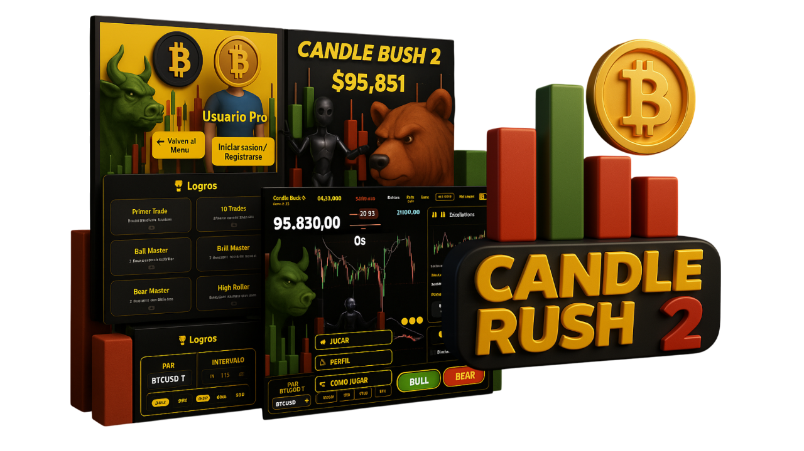

# CandleRush2: Crypto Betting Game

<p align="center">
  
</p>

> Simulador de apuestas algorítmicas sobre velas y tendencias del mercado cripto. 
> ¡Apuesta manual o automáticamente y explora la lógica detrás de cada decisión!

## 🗂️ Índice

- [🚀 Introducción](#introducción)
- [🛠️ Instalación y Configuración](#instalación-y-configuración)
- [🎲 Cómo Funciona](#cómo-funciona)
- [🤖 AutoMix: Algoritmo Multi-Voto](#automix-algoritmo-multi-voto)
- [🧩 Arquitectura del Proyecto](#arquitectura-del-proyecto)
- [🕯️ Candle Predictor](#candle-predictor)
- [🔌 Integración con APIs](#integración-con-apis)
- [⚙️ Personalización](#personalización)
- [👥 Créditos](#créditos)

---

## 🚀 Introducción

CandleRush2 es una plataforma gamificada de predicción de mercados donde los usuarios apuestan sobre el comportamiento de velas japonesas (candlesticks) en criptomonedas. El objetivo es ofrecer una experiencia educativa, transparente y científicamente fundamentada, combinando análisis técnico, probabilidad y gamificación.

### Características Principales

- **Apuestas manuales y automáticas** sobre velas de criptomonedas
- **Algoritmo AutoMix** con múltiples indicadores técnicos
- **Sistema de memoria y transparencia** para auditar decisiones
- **Simulador de velas** para backtesting y práctica
- **Integración con Binance API** para datos en tiempo real
- **Detección de rachas** y gestión de riesgo

---

## 🛠️ Instalación y Configuración

### Requisitos
- Node.js >= 18
- npm >= 9
- Navegador moderno

### Instalación
```bash
# Clonar el repositorio
git clone [URL_DEL_REPO]
cd crypto-betting

# Instalar dependencias
npm install
# o si hay problemas de dependencias:
npm install --legacy-peer-deps

# Ejecutar en desarrollo
npm run dev
```

### Estructura del Proyecto
```
crypto-betting/
├── app/                    # Rutas y layout principal
├── components/             # Componentes de UI
│   ├── game/              # Lógica específica del juego
│   └── ui/                # Componentes reutilizables
├── context/               # Contextos globales
├── utils/                 # Utilidades y algoritmos
├── public/                # Recursos estáticos
└── types/                 # Definiciones de tipos
```

---

## 🎲 Cómo Funciona

### Modalidades de Juego

1. **Apuestas Manuales**: El usuario elige dirección (BULL/BEAR) y cantidad
2. **AutoMix**: Algoritmo automático basado en indicadores técnicos
3. **Auto Bullish/Bearish**: Apuestas automáticas en una sola dirección

### Mecánica de Apuestas

- Los usuarios apuestan sobre la dirección de la siguiente vela
- Las apuestas se resuelven al cierre de cada vela
- Sistema de apalancamiento configurable
- Gestión de balance y liquidaciones

---

## 🤖 AutoMix: Algoritmo Multi-Voto

AutoMix es el cerebro del sistema que toma decisiones de trading basadas en múltiples señales técnicas.

### Indicadores Utilizados

| Indicador | Peso | Descripción |
|-----------|------|-------------|
| **Mayoría de Velas** | 1.0 | Análisis de las últimas 70 velas |
| **RSI** | 1.0 | Señal alcista >60, bajista <40 |
| **MACD** | 1.0 | Cruce de líneas MACD y señal |
| **Fibonacci** | 1.0 | Rebotes en niveles clave |
| **Valle** | 1.0 | Patrones de apertura/cierre |
| **Tendencia General** | 1.0 | Análisis de 70 velas |
| **Volumen** | 1.0 | Tendencia de volumen en 30 velas |
| **EMA 55/200** | 0.5 | Posición respecto a medias móviles |
| **Whale Trades** | 2.0 | Operaciones de grandes inversores |
| **ADX + Memoria** | 1.0 | Fuerza de tendencia con histórico |

**Total posible**: 12.5 votos por lado (BULLISH/BEARISH)

### Sistema de Decisión

1. **Votación Proporcional**: Cada señal aporta su voto según dirección
2. **Suma de Votos**: Se totalizan votos BULLISH vs BEARISH
3. **Desempate**: Si hay empate, decide el MACD
4. **Aleatorio**: Si no hay mayoría ni RSI claro, decisión aleatoria

### Detección de Rachas

#### Gestión de Pérdidas
- Revisa las últimas 15 operaciones
- Cambia dirección después de 4 pérdidas consecutivas
- Resetea contadores al cambiar dirección

#### Mantenimiento de Ganancias
- Mantiene dirección después de 2 ganancias consecutivas
- Ignora inversiones basadas en patrones durante rachas ganadoras
- Optimiza tendencias rentables

### Ejemplo de Secuencia

```
Vela 1: RSI=65, MACD=BULL, Mayoría=BULL → Decisión: BULL → Resultado: WIN
Vela 2: RSI=35, MACD=BEAR, Mayoría=BEAR → Decisión: BEAR → Resultado: WIN
Vela 3: RSI=45, MACD=BULL, Mayoría=null → Decisión: Aleatorio → Resultado: LOSS
```

---

## 🧩 Arquitectura del Proyecto

### Componentes Principales

#### `game-screen.tsx`
- Orquestador principal del juego
- Gestiona estado global (apuestas, historial, saldo)
- Coordina ciclo de vida de las velas

#### `candlestick-chart.tsx`
- Renderizado científico en Canvas
- Visualización de velas, señales y volumen
- Soporte para zoom, drag e interactividad

#### `bet-result-modal.tsx`
- Modal de transparencia para resultados
- Desglose completo de señales AutoMix
- Análisis de cada apuesta resuelta

#### `autoMixMemory.ts`
- Sistema de persistencia en localStorage
- Almacena hasta 666 entradas de tendencias
- Facilita auditoría y backtesting

#### `macd-decision.ts`
- Núcleo algorítmico de AutoMix
- Cálculo de indicadores técnicos
- Lógica de votación y decisión

### Contextos Globales

- **GameContext**: Estado del juego, apuestas, balance
- **AuthContext**: Autenticación y usuarios
- **AchievementContext**: Sistema de logros
- **DeviceModeContext**: Adaptación móvil/desktop

---

## 🕯️ Candle Predictor

El Candle Predictor es el motor de simulación que genera velas realistas para backtesting y práctica.

### Características

- **Fases de Mercado**: Alterna entre tendencia y rango
- **Breakouts**: Detecta y simula rupturas de precio
- **Volatilidad Dinámica**: Eventos volátiles aleatorios
- **Whale Trades**: Integración de operaciones grandes
- **Indicadores Internos**: EMAs, RSI, ADX, MACD

### Algoritmos

1. **Detección de Fases**: Identifica tendencias y rangos
2. **Gestión de Breakouts**: Clasifica rupturas (weak/medium/strong)
3. **Volatilidad Adaptativa**: Ajusta según condiciones de mercado
4. **Soportes/Resistencias**: Simula rebotes y rechazos

### Ubicación
- **Archivo principal**: `utils/autoDraw.ts`
- **Integración**: `candlestick-chart.tsx`
- **Tipos**: Extensión del tipo `Candle`

---

## 🔌 Integración con APIs

### Binance API
- **Datos históricos**: REST API para velas pasadas
- **Tiempo real**: WebSocket para nuevas velas
- **Reconexión**: Sistema automático de reintentos
- **Sincronización**: Resolución atómica de apuestas

### Flujo de Datos
1. Selección de par y timeframe
2. Descarga de velas históricas
3. Apertura de WebSocket
4. Resolución automática al cierre de vela

---

## ⚙️ Personalización

### Añadir Nuevos Indicadores

```typescript
// En macd-decision.ts
export function calculateNewIndicator(candles: Candle[]): Signal {
  // Tu lógica aquí
  return { direction: 'BULLISH', strength: 0.8 };
}
```

### Modificar Pesos de Votación

```typescript
// Ajustar pesos en el sistema de votación
const indicatorWeights = {
  rsi: 1.0,
  macd: 1.0,
  whales: 2.0,  // Modificar aquí
  // ...
};
```

### Configurar Nuevos Pares

```typescript
// En game-controls.tsx
const AVAILABLE_SYMBOLS = [
  'BTCUSDT', 'ETHUSDT', 'ADAUSDT', // Añadir aquí
];
```

### Personalizar Rachas

```typescript
// Modificar umbrales de detección
const LOSS_THRESHOLD = 4;  // Cambiar dirección tras N pérdidas
const WIN_THRESHOLD = 2;   // Mantener tras N ganancias
```

---

## 👥 Créditos

### Tecnologías Utilizadas
- **Frontend**: React, Next.js, TypeScript
- **Estilos**: TailwindCSS, Radix UI
- **Gráficos**: Canvas API, D3.js
- **Iconos**: Lucide Icons
- **APIs**: Binance WebSocket/REST

### Autor
- **Carlos Freire** - Desarrollo principal
- **Contacto**: [@CarlosFreire0](https://x.com/CarlosFreire0)

### Licencia
MIT License - Consulta el archivo LICENSE para más detalles.

---

## 📊 Memoria y Transparencia

Todas las decisiones de AutoMix se almacenan localmente, permitiendo:

- **Auditoría completa** de cada apuesta
- **Análisis histórico** de patrones
- **Backtesting** de estrategias
- **Transparencia total** en el proceso

### Acceso a Memorias
- Historial completo en el perfil de usuario
- Exportación de datos para análisis externo
- Visualización de tendencias y patrones
- Métricas de rendimiento detalladas

---

*Última actualización: 2025*
